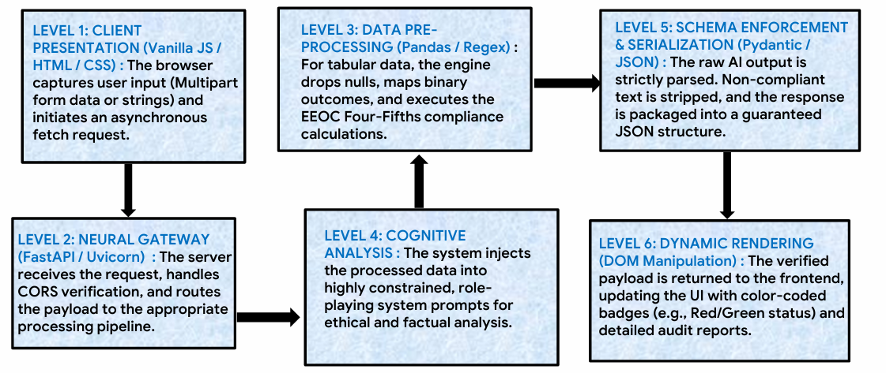
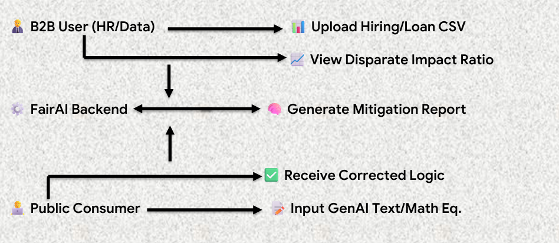
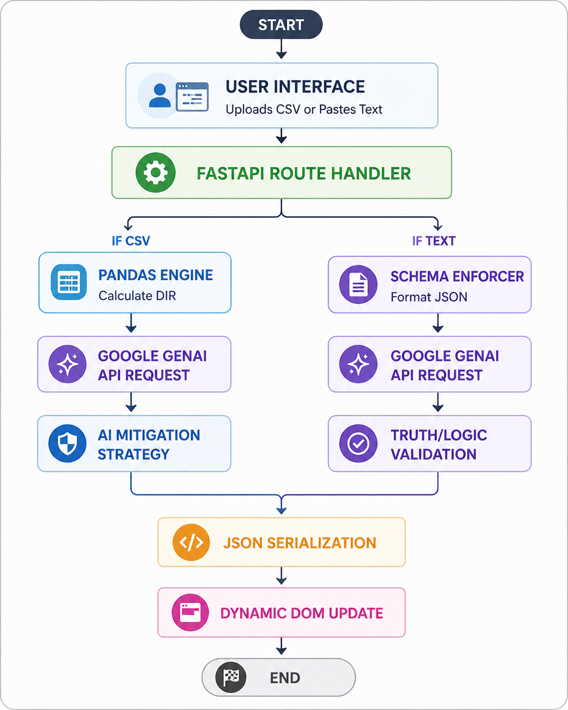

# 🚀 FairAI — Ethical AI Audit & Validation Platform

**Developed by:** Suchetana Mukherjee

 

---

## 🌟 Overview

Machine learning models and datasets frequently contain hidden ethical biases regarding demographics like race, gender, or age. **FairAI** is a powerful, decoupled full-stack web application designed to automatically analyze datasets for ethical bias.

Instead of requiring complex data science knowledge, **FairAI** democratizes AI safety by providing a "no-code" interface for non-technical stakeholders, empowering anyone to instantly identify and correct algorithmic bias.
**FairAI** is an intelligent platform designed to analyze, audit, and validate decision-making systems powered by AI. It focuses on one critical question:

> *"Can we trust the outputs of AI systems?"*

FairAI provides a seamless way to:
* **Detect bias** in datasets
* **Validate** logical correctness of statements
* **Ensure fairness** and transparency in automated systems

All of this is delivered through a simple, interactive interface powered by an integrated AI engine.

---

## 🎯 Problem Statement

Modern AI systems are widely used in critical areas such as:
* Hiring decisions
* Loan approvals
* Medical recommendations

However, these systems often face severe challenges:
* ⚠️ Contain hidden demographic bias
* ⚠️ Produce unverified or incorrect outputs
* ⚠️ Lack operational transparency

**FairAI** addresses these challenges directly by acting as an independent auditing layer over AI systems.

---

## 💡 Solution

FairAI combines data analysis and AI validation into a single platform that helps users:

* ✔️ **Identify bias** in datasets effortlessly.
* ✔️ **Understand fairness metrics** in simple, non-technical terms.
* ✔️ **Validate logical and factual correctness** of statements.
* ✔️ **Receive structured and actionable insights** to mitigate bias.

It transforms complex AI auditing into a no-code, user-friendly experience.

---

## ⚙️ How It Works (Conceptual Flow)

1. **Input:** The user inputs a dataset (CSV) or factual text.
2. **Processing:** The backend engine processes the input efficiently.
3. **Calculation:** Mathematical algorithms and strict logical checks are applied.
4. **Analysis:** The Integrated AI analyzes and interprets the raw results.
5. **Synthesis:** A structured, easy-to-read response is generated.
6. **Display:** Results are rendered in a dynamic, intuitive UI format.

---

## 🧠 Key Features

### 📊 Dataset Fairness Auditor
* **Upload Datasets:** Supports standard CSV format ingestion.
* **Auto-Detection:** Automatically detects sensitive attributes (e.g., gender, race, age).
* **Metric Evaluation:** Evaluates fairness using industry-standard calculations.
* **Clear Highlights:** Highlights potential bias and provides mitigation strategies clearly.

### 🔍 Logic & Fact Validator
* **Strict Validation:** Accepts user input (statements, logic, facts) and performs rigorous schema-enforced validation.
* **Structured Returns:**
  * ✔️ Correct / ❌ Incorrect Status
  * 📝 Detailed Explanation
  * 🔄 Corrected version (if needed)

### ⚡ Real-Time Insights
* Fast API-driven processing for instantaneous feedback and structured reports.

### 🧩 Unified Platform
* Unlike traditional tools that separate text validation and data auditing, FairAI provides a single, cohesive, integrated solution.

---

## 🏗️ Architecture

### 📌 System Architecture Diagram
> 

### 📌 Use Case Diagram
> 
 
### 📌 Process Flow Diagram
> 

---

## 🛠️ Tech Stack (High-Level)

* **Frontend:** Interactive Web Interface (HTML, CSS, JavaScript)
* **Backend:** API-based processing system
* **Data Processing:** Structured data analysis engine
* **AI Engine:** Integrated AI API for generative validation and interpretation
*(Note: Implementation details intentionally kept abstract for simplicity.)*

---

## 🚀 Unique Value Proposition

| Feature | Traditional Tools | FairAI Solution |
| :--- | :--- | :--- |
| **Ease of Use** | Complex, highly technical | **Simple & intuitive interface** |
| **Bias Detection** | Requires code/limited access | **One-click "No-Code" analysis** |
| **Validation** | Conversational & vague | **Structured & strict Boolean validation** |
| **Integration** | Separate disconnected tools | **All-in-one unified platform** |

---

## 🌍 Impact

FairAI is built to contribute to:
* Ethical AI development
* Responsible data usage
* Transparency in automated decision-making

It aligns with global goals surrounding **AI safety, fairness and accountability, and inclusive technology.**

---

## 📁 Project Structure
```text
/FairAI-Audit-Platform  
├── .venv
├── main.py                <-- The "Brain" (API, Logic, AI Routing)
├── .env                   <-- The "Vault" (Environment Variables & Keys)
├── requirements.txt  
└── /Frontend              <-- The "Face" (User Experience)
    ├── index.html         <-- Structural Layout
    ├── style.css          <-- Visuals & Theming
    └── app.js             <-- The "Messenger" (Dynamic UI Updates)
```
---

## 📌 Future Enhancements

* 📈 **Advanced visualization and analytics dashboards.**

* 🌐 **Multi-language support for global accessibility.**

* 🧮 **Expanded fairness metrics (beyond standard Disparate Impact).**

* 🏢 **Integration capabilities with existing enterprise systems.**

---
  
## 🎥 Live Demo & MVP

> *"Want to see FairAI in action?"*


* **Demo Video:** [Watch the Walkthrough](https://youtu.be/hoYRee8v4B4)

---

## 🤝 Contribution
Contributions, suggestions, and improvements are highly welcome! feel free to submit a pull request.

---

## 📬 Contact
Suchetana Mukherjee

For queries, feedback, or collaboration opportunities, feel free to connect!
